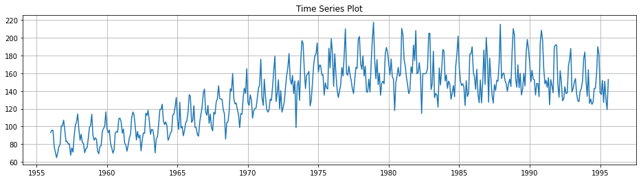
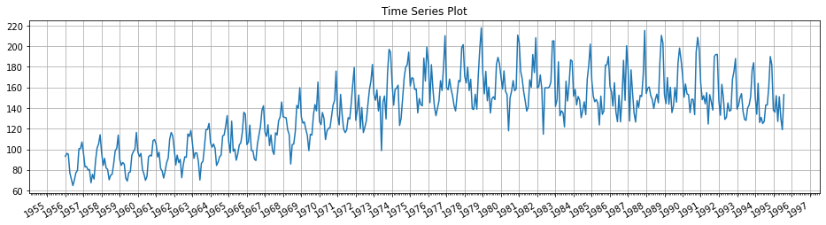

# Python: Matplotlib

시계열(time-series) 데이터의 플롯(plot) `matplotlib`으로 그리는 2가지 방법.

## Matlab Style



```py
# single plot
plt.figure(figsize = (w, h))
plt.plot(datetime, value)

# multiple plots
plt.figure(figsize = (w, h))
plt.subplot(row, col, idx)
plt.plot(datetime, value)
```

## OOP Style



```py
# single plot
fig, ax = plt.subplots(figsize = (w, h))
ax.plot(datetime, value)

# multiple plots
fig, axes = plt.subplots(col, row, figsize = (w, h))
axes[col][row].plot(datetime, value)
```

### Formatting

```py
import matplotlib.dates as mdates

# formatting
fig.autofmt_xdate()

ax.xaxis.set_major_locator(mdates.YearLocator())
ax.xaxis.set_major_formatter(mdates.DateFormatter('%Y'))

ax.xaxis.set_minor_locator(mdates.MonthLocator())
ax.xaxis.set_minor_formatter(mdates.DateFormatter('%m'))

ax.grid()
```